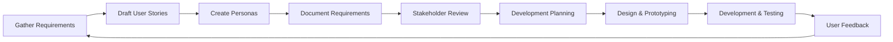

# Surfing Trip Application - Documentation Index

Welcome to the Surfing Trip Application documentation. This directory contains foundational documents that define the product requirements, user needs, and development guidelines for the application.

## 📋 Core Documentation

### [Product Requirements Document (PRD)](./product-requirements.md)
Comprehensive overview of the product vision, core features, technical requirements, and success metrics. This document serves as the primary reference for all stakeholders and development decisions.

**Key Sections:**
- Product Overview & Vision
- Core Features & Requirements
- Technical Specifications
- User Experience Guidelines
- Success Metrics & KPIs
- Launch Strategy & Roadmap

### [User Stories](./user-stories.md)
Detailed user stories organized by epic, covering all major features and user interactions. Each story includes acceptance criteria, priority levels, and story points for development planning.

**Key Epics:**
- Trip Planning & Management
- Surf Spot Discovery
- Surf Lesson Booking
- Weather & Conditions
- Community Features
- Mobile Experience
- Search and Discovery

### [User Personas](./user-personas.md)
Five detailed user personas representing our target audience, including demographics, motivations, pain points, and usage patterns. These personas guide design decisions and feature prioritization.

**Primary Personas:**
- Sarah "The Adventure Seeker" Johnson - Intermediate surfer, trip organizer
- Mike "The Dedicated Local" Rodriguez - Advanced local surfer, surf shop owner
- Emma "The Beginner" Thompson - New surfer, seeking lessons and guidance

**Secondary Personas:**
- David "The Surf Coach" Wilson - Professional instructor, business owner
- Lisa "The Traveling Professional" Chen - High-income surfer, time-constrained

## 🎯 How to Use This Documentation

### For Product Managers
- Reference the PRD for feature definitions and business requirements
- Use personas to validate feature decisions and prioritization
- Track user stories for development planning and sprint organization

### For Designers
- Use personas to understand user needs and design empathetic solutions
- Reference UX requirements in the PRD for design guidelines
- Consider user stories as design scenarios for user flows and wireframes

### For Developers
- Follow technical requirements outlined in the PRD
- Use user stories as development tasks with clear acceptance criteria
- Reference personas to understand context behind feature requirements

### For Stakeholders
- PRD provides comprehensive product overview and business case
- Success metrics section defines how we measure product success
- Launch strategy outlines go-to-market approach and timeline

## 🔄 Document Maintenance

These documents are living resources that should be updated as the product evolves:

- **Product Requirements**: Update quarterly or when major features are added
- **User Stories**: Update continuously as stories are completed and new ones are identified
- **User Personas**: Review annually or when significant user research is conducted

## 📊 Supporting Materials

### Mermaid Diagram - Development Process Flow

### Quick Reference Links

- **Feature Priority Matrix**: Reference user stories for High/Medium/Low priority features
- **Technical Stack**: See PRD Section 3 for technology requirements
- **Success Metrics**: See PRD Section 5 for KPIs and measurement criteria
- **Competitive Analysis**: Consider expansion opportunities in PRD Section 8

## 📞 Contact & Feedback

For questions about this documentation or suggestions for improvements:

- Create an issue in the project repository
- Contact the product team through established channels
- Participate in regular stakeholder review meetings

---

*Last updated: [Date will be automatically updated by version control]*

*These documents form the foundation of our product development process and should be consulted regularly throughout the development lifecycle.*