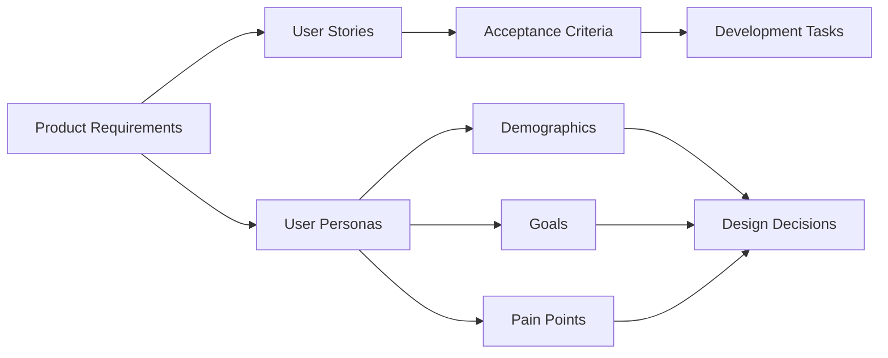

# Surfing Trip Application Documentation

This directory contains the comprehensive documentation for the Surfing Trip application, including product requirements, user stories, and user personas that will guide the development process.

## Documentation Structure

- [`product-requirements.md`](./product-requirements.md) - Comprehensive Product Requirements Document (PRD)
- [`user-personas.md`](./user-personas.md) - Detailed user personas with demographics, goals, and pain points
- [`user-stories.md`](./user-stories.md) - User stories with acceptance criteria
- [`architecture-overview.md`](./architecture-overview.md) - Technical architecture and system design

## Quick Navigation

### Core Documents
1. **[Product Requirements](./product-requirements.md)** - Start here to understand the overall product vision, goals, and functional requirements
2. **[User Personas](./user-personas.md)** - Understand our target users and their motivations
3. **[User Stories](./user-stories.md)** - Detailed user stories with acceptance criteria for development

### Architecture
- **[Architecture Overview](./architecture-overview.md)** - Technical implementation approach and system design

## Document Relationships

This documentation serves as the foundation for developing a comprehensive surfing trip planning and management application.