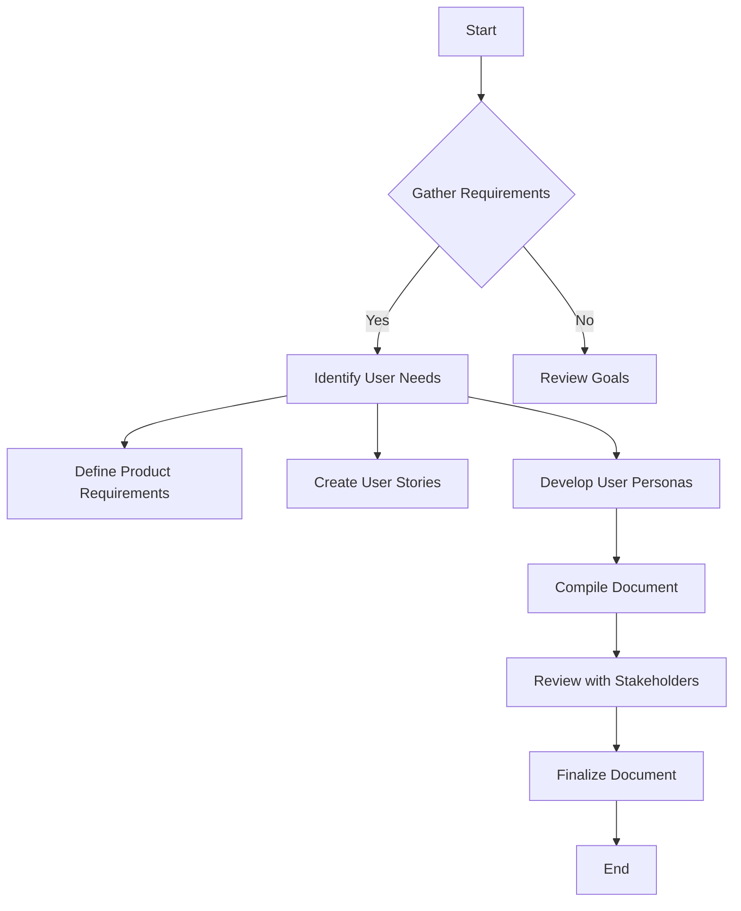

# Surfing Trip Application - Product Documentation

This directory contains comprehensive product documentation for the Surfing Trip application, a Next.js-based platform designed to provide users with the ultimate surfing experience, from trip planning to finding the best surf spots.

## 📋 Documentation Overview

- **[Product Requirements](./product-requirements.md)** - Core functionalities and features
- **[User Stories](./user-stories.md)** - User interactions and journeys through the application
- **[User Personas](./user-personas.md)** - Target audience profiles, goals, and motivations

## 🎯 Application Vision

The Surfing Trip application aims to be the go-to platform for surfers of all levels to:
- Plan comprehensive surf trips
- Discover the best surf spots worldwide
- Connect with the global surfing community
- Access real-time surf conditions and forecasts
- Share experiences and build lasting memories

## 🛠️ Technical Foundation

Built with modern web technologies:
- **Next.js 15** - React framework for production
- **TypeScript** - Type-safe development
- **Tailwind CSS** - Utility-first styling
- **shadcn/ui** - Modern UI component library
- **Radix UI** - Accessible component primitives

## 📊 Requirements Process

This documentation follows the requirements gathering process outlined in issue #14:

## 🚀 Next Steps

1. Review all documentation files
2. Validate requirements with stakeholders
3. Prioritize features for development phases
4. Begin technical specification and design phase