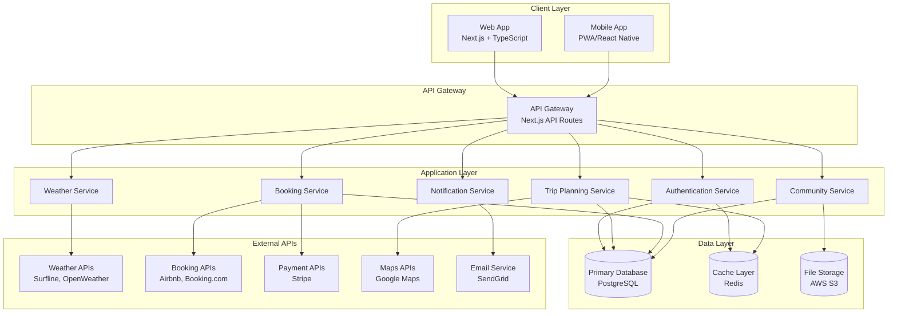
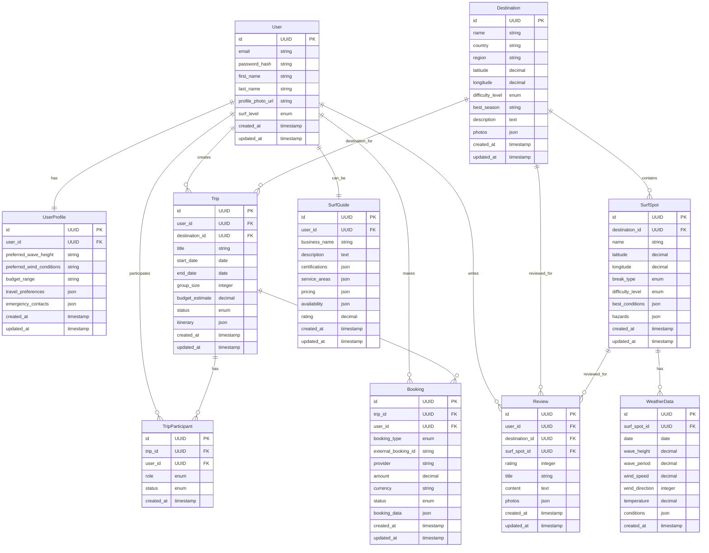
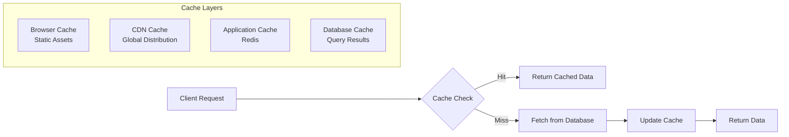
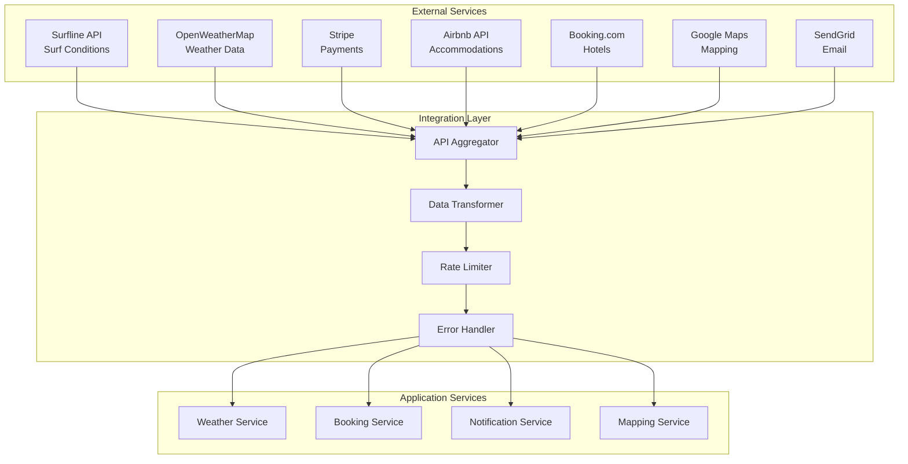

# Architecture Overview
# Surfing Trip Application

## System Architecture

### High-Level Architecture Diagram



### Technology Stack

#### Frontend
- **Framework**: Next.js 15 with React 19
- **Language**: TypeScript
- **Styling**: Tailwind CSS
- **UI Components**: shadcn/ui (Radix UI primitives)
- **State Management**: React Context + React Query
- **Forms**: React Hook Form + Zod validation
- **Authentication**: NextAuth.js
- **Maps**: Mapbox GL JS
- **Mobile**: Progressive Web App (PWA) with offline capabilities

#### Backend
- **Runtime**: Node.js
- **Framework**: Next.js API Routes
- **Database**: PostgreSQL with Prisma ORM
- **Cache**: Redis for session management and API caching
- **File Storage**: AWS S3 for images and documents
- **Authentication**: NextAuth.js with JWT tokens
- **Real-time**: Server-Sent Events (SSE) for live updates

#### Infrastructure
- **Hosting**: Vercel (Frontend) + AWS (Backend services)
- **Database**: AWS RDS PostgreSQL
- **Cache**: AWS ElastiCache Redis
- **CDN**: Vercel Edge Network
- **Monitoring**: Vercel Analytics + Sentry
- **CI/CD**: GitHub Actions

### Database Schema



### API Design

#### Authentication Endpoints
```
POST /api/auth/register
POST /api/auth/login
POST /api/auth/logout
GET  /api/auth/me
PUT  /api/auth/profile
```

#### Destination & Planning Endpoints
```
GET    /api/destinations
GET    /api/destinations/:id
GET    /api/destinations/:id/surf-spots
GET    /api/surf-spots/:id/weather
POST   /api/trips
GET    /api/trips
GET    /api/trips/:id
PUT    /api/trips/:id
DELETE /api/trips/:id
```

#### Booking Endpoints
```
GET  /api/accommodations/search
POST /api/bookings
GET  /api/bookings
GET  /api/bookings/:id
PUT  /api/bookings/:id/cancel
```

#### Community Endpoints
```
GET    /api/reviews
POST   /api/reviews
GET    /api/reviews/:id
PUT    /api/reviews/:id
DELETE /api/reviews/:id
GET    /api/users/:id/profile
POST   /api/messages
GET    /api/messages
```

### Security Architecture

#### Authentication & Authorization
- **JWT Tokens**: Secure token-based authentication
- **Role-Based Access**: User, Guide, Admin roles
- **Session Management**: Redis-based session storage
- **Password Security**: bcrypt hashing with salt
- **Two-Factor Authentication**: Optional TOTP support

#### Data Protection
- **Encryption**: AES-256 encryption for sensitive data at rest
- **TLS/SSL**: All API communications encrypted in transit
- **API Rate Limiting**: Prevent abuse and DDoS attacks
- **Input Validation**: Comprehensive input sanitization
- **CORS**: Configured for security without blocking legitimate requests

#### Privacy & Compliance
- **GDPR Compliance**: Data portability and deletion rights
- **Data Minimization**: Collect only necessary user data
- **Consent Management**: Clear consent for data collection
- **Audit Logging**: Track data access and modifications
- **PCI DSS**: Secure payment processing standards

### Performance & Scalability

#### Caching Strategy


#### Optimization Strategies
- **Code Splitting**: Load only necessary JavaScript
- **Image Optimization**: Next.js Image component with WebP
- **Database Indexing**: Optimized queries with proper indexes
- **CDN Integration**: Global content delivery
- **Lazy Loading**: Components and images loaded on demand
- **API Response Caching**: Redis caching for expensive operations

#### Monitoring & Observability
- **Application Monitoring**: Real-time performance tracking
- **Error Tracking**: Sentry for error monitoring and alerting
- **Database Monitoring**: Query performance and optimization
- **User Analytics**: Usage patterns and feature adoption
- **Uptime Monitoring**: Service availability tracking

### Mobile Strategy

#### Progressive Web App (PWA)
- **Service Workers**: Offline functionality and caching
- **App Manifest**: Native app-like experience
- **Push Notifications**: Real-time alerts and updates
- **Offline Storage**: IndexedDB for offline data
- **Background Sync**: Sync data when connectivity returns

#### Mobile-First Design
- **Responsive Design**: Optimized for all screen sizes
- **Touch Interface**: Gesture-friendly interactions
- **Performance**: Optimized for mobile networks
- **Battery Efficiency**: Minimized background processing
- **App Store Deployment**: PWA installable from browsers

### Integration Architecture

#### Third-Party APIs


#### API Gateway Features
- **Request Routing**: Route requests to appropriate services
- **Authentication**: Validate user tokens
- **Rate Limiting**: Prevent API abuse
- **Request/Response Transformation**: Format data consistently
- **Error Handling**: Standardized error responses
- **Logging**: Comprehensive request logging

### Deployment Architecture

#### Development Environment
- **Local Development**: Docker containers for consistency
- **Database**: PostgreSQL container with sample data
- **Cache**: Redis container
- **External APIs**: Mock services for testing

#### Staging Environment
- **Vercel Preview**: Branch-based preview deployments
- **Database**: Separate staging database
- **API Testing**: Automated API testing pipeline
- **Performance Testing**: Load testing with staging data

#### Production Environment
- **Vercel Production**: Global edge deployment
- **AWS RDS**: Production PostgreSQL database
- **AWS ElastiCache**: Production Redis cache
- **AWS S3**: Production file storage
- **Monitoring**: Full observability stack

### Disaster Recovery & Backup

#### Backup Strategy
- **Database Backups**: Daily automated backups with 30-day retention
- **File Storage**: S3 cross-region replication
- **Configuration Backup**: Infrastructure as Code (Terraform)
- **Code Repository**: GitHub with protected main branch

#### Recovery Procedures
- **RTO (Recovery Time Objective)**: 4 hours
- **RPO (Recovery Point Objective)**: 1 hour
- **Failover Process**: Automated failover for critical services
- **Data Recovery**: Point-in-time recovery capabilities

This architecture provides a solid foundation for the Surfing Trip application, ensuring scalability, security, and maintainability while delivering an excellent user experience across all devices and platforms.