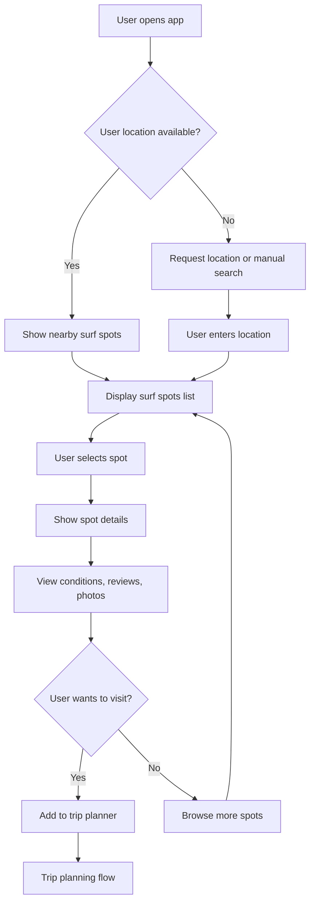
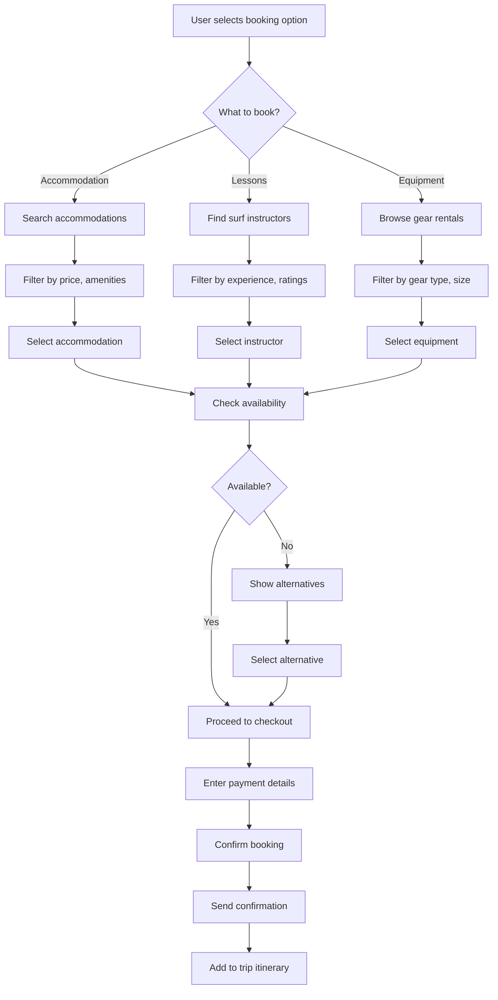
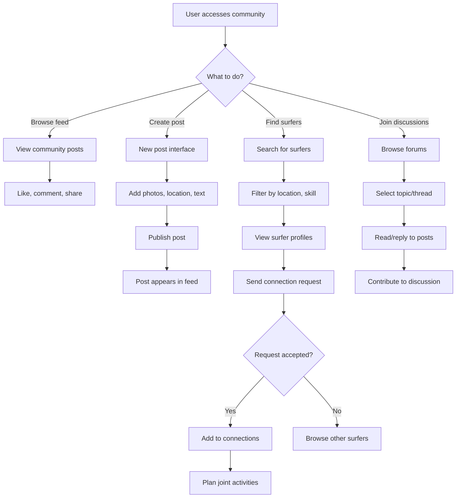
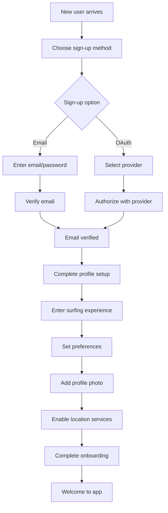
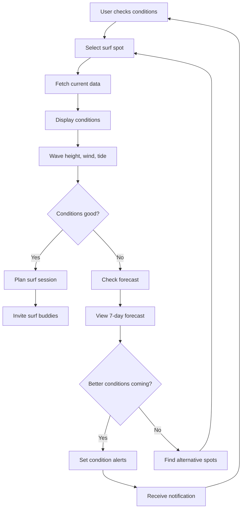
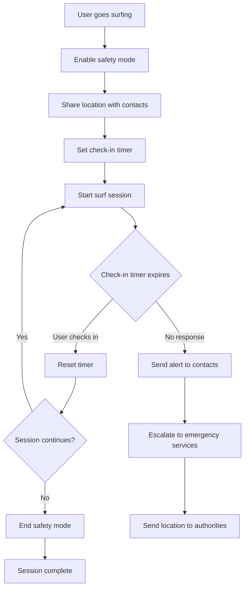
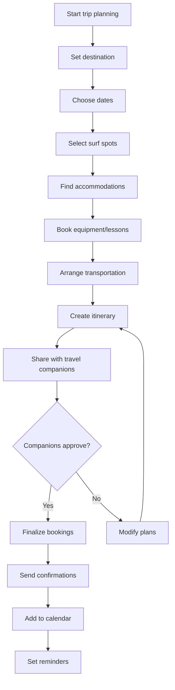
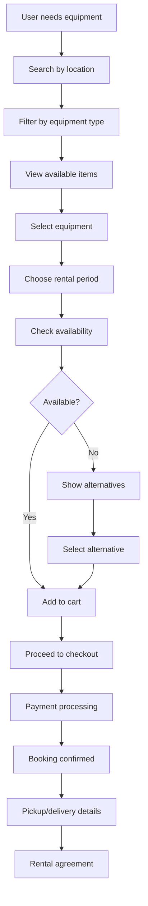
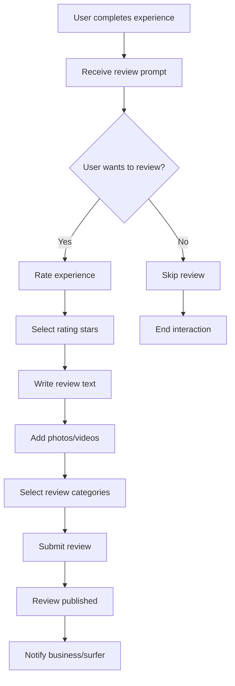
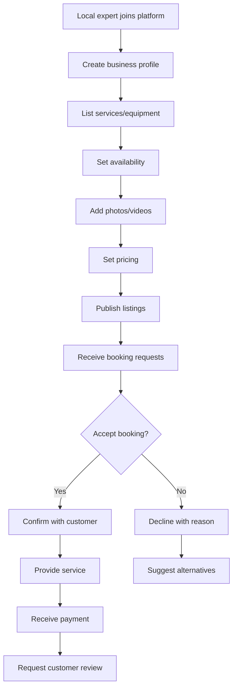

# User Flow Diagrams for Surfing Trip Application

This document contains mermaid diagrams illustrating key user flows for the Surfing Trip application.

## 1. Surf Spot Discovery Flow

## 2. Booking Flow

## 3. Community Interaction Flow

## 4. User Registration and Profile Setup

## 5. Real-time Conditions Check Flow

## 6. Safety and Emergency Flow

## 7. Trip Planning Flow

## 8. Equipment Rental Flow

## 9. Review and Rating Flow

## 10. Local Expert/Business Flow

